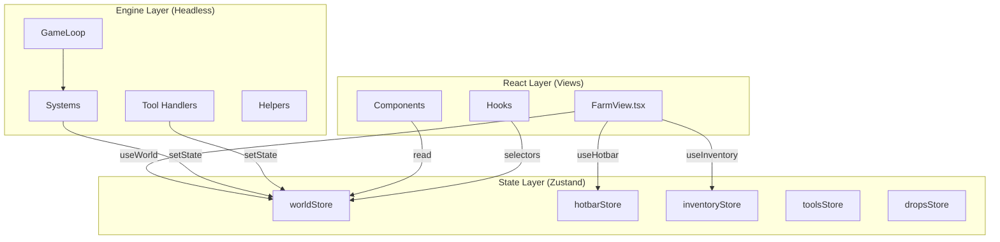

# Game Engine Architecture

## Descripción General

El proyecto usa una arquitectura **Headless Game Engine** donde la lógica de simulación corre independientemente de React, usando Zustand como puente de estado.

**Principio fundamental**: Si React desaparece mañana, el juego sigue funcionando.

---

## Principios de Arquitectura

### 1. **Motor Primero**

- La lógica reside en `src/engine/`
- NO depende de React
- NO usa JSX ni hooks

### 2. **React Segundo**

- Los componentes en `src/views/` son puramente presentacionales
- Solo manejan input del usuario
- Observan el estado, no lo mutan directamente

### 3. **Zustand como Puente**

- Contiene la "fuente de verdad"
- El Engine **escribe** en Zustand
- React **lee** de Zustand
- Usa API Vanilla para permitir acceso desde el Engine

---

## Arquitectura de Capas



---

## Core Components

### 1. GameLoop

**Archivo**: `src/engine/GameLoop.ts`

**Responsabilidad**: Ejecutar la simulación a intervalos regulares

**Implementación**:

```typescript
export class GameLoop {
  private systems: ISystem[] = []
  private intervalId: number | null = null
  private readonly baseTickInterval = 1000 // 1 segundo real

  constructor() {
    this.systems.push(new TimeSystem())
    this.systems.push(new WaterEvaporationSystem())
    this.systems.push(new CropGrowthSystem())
    this.systems.push(new DropTickSystem())
  }

  start(): void {
    this.runLoop()
  }

  private runLoop(): void {
    const state = worldStore.getState()
    const interval = this.baseTickInterval / state.timeScale

    this.intervalId = window.setInterval(() => {
      this.tick()

      // Reiniciar si timeScale cambió
      const currentScale = worldStore.getState().timeScale
      if (currentScale !== state.timeScale) {
        this.stop()
        this.runLoop()
      }
    }, interval)
  }

  private tick(): void {
    for (const system of this.systems) {
      system.update()
    }
  }
}
```

**Características**:

- ✅ Usa `setInterval`, NO `requestAnimationFrame`
- ✅ Soporta `timeScale` (x1, x2, x4, x10)
- ✅ Puede pausarse/reanudarse
- ✅ Registra sistemas dinámicamente

---

### 2. Systems

**Interface**: `ISystem`

```typescript
export interface ISystem {
  update(): void
}
```

#### Sistemas Implementados

| Sistema                    | Archivo                     | Responsabilidad                                 |
| -------------------------- | --------------------------- | ----------------------------------------------- |
| **TimeSystem**             | `TimeSystem.ts`             | Avanza el tiempo del juego (1 tick = 1 minuto)  |
| **CropGrowthSystem**       | `CropGrowthSystem.ts`       | Crecimiento de cultivos, muerte (deshabilitada) |
| **WaterEvaporationSystem** | `WaterEvaporationSystem.ts` | Reset de agua a las 6am                         |
| **DropTickSystem**         | `DropTickSystem.ts`         | Limpieza de drops animados                      |

#### TimeSystem

**Conversión**: 1 tick (1 segundo real) = 1 minuto del juego

**Ciclo completo**: 24 horas del juego = 1440 minutos = 24 minutos reales (a x1)

```typescript
export class TimeSystem implements ISystem {
  update(): void {
    worldActions.tick() // Avanza 1 minuto del juego
  }
}
```

**Estado del tiempo**:

```typescript
interface GameTime {
  hour: number // 0-23
  minute: number // 0-59
  day: number // Contador de días
  totalMinutes: number // Minutos totales desde inicio
}
```

---

### 3. Stores (Zustand Vanilla)

#### worldStore

**Archivo**: `src/engine/store.ts`

**Estado**:

```typescript
interface WorldState {
  gameTime: GameTime
  isPaused: boolean
  timeScale: number
  activeTool: Tool | null
  entities: Entity[]
  tilledSoil: Map<string, TilledTile>
}
```

**Acciones**:

```typescript
export const worldActions = {
  tick: () => { ... },              // Avanza tiempo
  pause: () => { ... },
  resume: () => { ... },
  setTimeScale: (scale) => { ... },
  setActiveTool: (tool) => { ... },
  clearTool: () => { ... },
}
```

#### hotbarStore

**Archivo**: `src/engine/hotbarStore.ts`

**Responsabilidad**: Sistema de hotbars (main + 2 custom)

**Estado**:

```typescript
interface HotbarState {
  activeHotbar: "main" | "custom1" | "custom2"
  activeSlotIndex: number
  mainHotbar: CustomSlot[] // 10 slots
  customHotbar1: CustomSlot[] // 10 slots
  customHotbar2: CustomSlot[] // 10 slots
  decorationMenuOpen: boolean
  selectedDecorationMode: DecorationMode | null
  mouseDrag: MouseDragState | null
}
```

#### inventoryStore

**Archivo**: `src/engine/inventoryStore.ts`

**Responsabilidad**: Inventario de 21 slots (3×7)

**Estado**:

```typescript
interface InventoryState {
  slots: (InventoryItem | null)[] // 21 slots fijos
  itemsMap: Map<string, InventoryItem> // Lookup O(1)
  isInventoryOpen: boolean
}
```

#### dropsStore

**Archivo**: `src/engine/dropsStore.ts`

**Responsabilidad**: Store aislado para animaciones de drops

**Ventaja**: No afecta performance del juego principal

---

### 4. Tool Handlers

**Archivo**: `src/engine/tools/toolRouter.ts`

**Responsabilidad**: Centralizar lógica de uso de herramientas

```typescript
export function handleToolUse({
  mouseTile,
  activeTool,
  activeItem,
  entities,
  tilledSoil,
  FARM_WIDTH,
  FARM_HEIGHT,
}) {
  // Routing según herramienta
  switch (activeTool) {
    case "hoe":
      return handleHoeTool(...)
    case "wateringCan":
      return handleWateringCan(...)
    case "pickaxe":
      // Lógica de pico...
    case "axe":
      // Lógica de hacha...
    case "scythe":
      // Lógica de guadaña...
  }

  // Seeds
  if (activeItem?.type === "seed") {
    return handleSeedPlanting(...)
  }
}
```

**Handlers individuales**:

- `hoeHandler.ts` - Arar tierra
- `wateringCanHandler.ts` - Regar
- `pickaxeHandler.ts` - Remover tierra arada
- `toolHandlers.ts` - Hacha, scythe, etc.

---

## React Integration

### Hooks

#### useWorld

**Archivo**: `src/hooks/useWorld.ts`

**Propósito**: Wrapper de React para acceder a `worldStore`

```typescript
export function useWorld<T>(selector: (state: WorldState) => T): T {
  return useStore(worldStore, selector)
}
```

**Uso correcto** (selectores específicos):

```typescript
// ✅ BIEN: Solo re-renderiza cuando cambia la hora
const hour = useWorld((s) => s.gameTime.hour)

// ❌ MAL: Re-renderiza en CUALQUIER cambio
const { gameTime } = useWorld()
```

#### Otros Hooks

- `useHotbar` - Acceso a hotbarStore
- `useInventory` - Acceso a inventoryStore
- `useTools` - Acceso a toolsStore
- `useViewport` - Controles de cámara
- `useShortcuts` - Shortcuts de teclado

---

### Componentes Principales

#### FarmView

**Archivo**: `src/views/game/farm/farm_view.tsx`

**Responsabilidad**: Vista principal del juego

**Funciones**:

- ✅ Renderiza viewport con grid y entidades
- ✅ Maneja input (mouse, teclado)
- ✅ Sincroniza hotbar con worldStore
- ✅ Delega lógica de herramientas al Engine

**Patrón**:

```typescript
export const FarmView = () => {
  // Leer estado (selectores específicos)
  const hour = useWorld((s) => s.gameTime.hour)
  const activeTool = useWorld((s) => s.activeTool)
  const entities = useWorld((s) => s.entities)

  // Handlers (delegan al Engine)
  function handleToolClick(e: React.MouseEvent) {
    if (!mouseTile) return

    handleToolUse({
      mouseTile,
      activeTool,
      entities,
      // ...
    })
  }

  return (
    <div>
      <Viewport onClick={handleToolClick}>
        <Grid />
        <TilledSoil />
        <GameEntities />
      </Viewport>
      <CurrentHotbar />
      <Inventory />
    </div>
  )
}
```

---

## Flujo de Datos

### 1. Simulación (Engine → Zustand)

```
GameLoop.tick()
    ↓
TimeSystem.update()
    ↓
worldActions.tick()
    ↓
worldStore.setState({ gameTime: newTime })
    ↓
React components re-render (solo los que usan ese selector)
```

### 2. Input del Usuario (React → Engine → Zustand)

```
Usuario hace click
    ↓
FarmView.handleToolClick()
    ↓
handleToolUse() (Engine)
    ↓
handleHoeTool() (Engine)
    ↓
worldStore.setState({ tilledSoil: newSoil })
    ↓
React components re-render
```

### 3. Hotbar (React ↔ Zustand)

```
Usuario presiona "1"
    ↓
useShortcuts → hotbarActions.selectSlot(0)
    ↓
hotbarStore.setState({ activeSlotIndex: 0 })
    ↓
useEffect en FarmView detecta cambio
    ↓
worldActions.setActiveTool(tool)
    ↓
worldStore.setState({ activeTool: tool })
```

---

## Performance Considerations

### Selectores Específicos

**Crítico**: Siempre usar selectores atómicos

```typescript
// ✅ BIEN: Solo re-renderiza cuando cambia entities
const entities = useWorld((s) => s.entities)

// ✅ MEJOR: Solo re-renderiza cuando cambia activeTool
const activeTool = useWorld((s) => s.activeTool)

// ❌ MAL: Re-renderiza en CUALQUIER cambio del worldStore
const state = useWorld()
```

### Vanilla Stores

**Ventaja**: El Engine puede actualizar estado sin causar renders

```typescript
// En CropGrowthSystem.ts
worldStore.setState({ entities: updatedEntities })
// React solo re-renderiza componentes que usan ese selector
```

### Isolated Stores

**dropsStore**: Store separado para animaciones

**Beneficio**: Animaciones no afectan performance del juego principal

---

## Time Scale System

### Velocidades Soportadas

| Scale | Tick Interval | Minutos Juego/Segundo Real |
| ----- | ------------- | -------------------------- |
| x1    | 1000ms        | 1 minuto                   |
| x2    | 500ms         | 2 minutos                  |
| x4    | 250ms         | 4 minutos                  |
| x10   | 100ms         | 10 minutos                 |

### Implementación

```typescript
// En GameLoop
const interval = this.baseTickInterval / state.timeScale

// x1: 1000ms / 1 = 1000ms
// x2: 1000ms / 2 = 500ms
// x10: 1000ms / 10 = 100ms
```

**Auto-restart**: Si `timeScale` cambia, el loop se reinicia con nuevo intervalo

---

## Debugging

### Debug Info Component

**Ubicación**: Bottom-left de `FarmView`

**Muestra**:

- Zoom y offset del viewport
- Tile bajo el mouse
- Herramienta activa
- Item activo

### Console Logs

Los handlers usan `console.log` para debugging:

```typescript
// En hoeHandler.ts
if (cropAtTile) {
  console.log("[Hoe Blocked] Crop at tile:", { x, y })
  return
}
```

---

## Archivos Clave

### Engine

- `src/engine/GameLoop.ts` - Loop principal
- `src/engine/store.ts` - Estado global
- `src/engine/systems/` - Sistemas del juego
- `src/engine/tools/` - Handlers de herramientas

### Stores

- `src/engine/hotbarStore.ts` - Hotbars
- `src/engine/inventoryStore.ts` - Inventario
- `src/engine/toolsStore.ts` - Orden de herramientas
- `src/engine/dropsStore.ts` - Animaciones

### Hooks

- `src/hooks/useWorld.ts` - Acceso a worldStore
- `src/hooks/useHotbar.ts` - Acceso a hotbarStore
- `src/hooks/useInventory.ts` - Acceso a inventoryStore
- `src/hooks/useShortcuts.ts` - Shortcuts de teclado

### Views

- `src/views/game/farm/farm_view.tsx` - Vista principal
- `src/components/` - Componentes de UI

---

## Verificación

### ✅ Implementado

1. **Flujo de Tiempo**
   - El tiempo avanza cada segundo (x1)
   - Ciclo de 24 horas funciona correctamente
   - TimeScale ajustable (x1, x2, x4, x10)

2. **Controles de Pausa**
   - Pausa detiene el loop completamente
   - Resume continúa desde donde se detuvo

3. **Separación Engine/React**
   - Engine no depende de React
   - React solo observa y maneja input
   - Zustand como puente único

4. **Performance**
   - Selectores específicos en todos los componentes
   - No hay re-renders innecesarios
   - Stores aislados para animaciones

---

## Referencias

- **Filosofía**: Ver `ai/context.md` para principios de diseño
- **Performance**: Ver `ai/knowing_issues.md` para optimizaciones futuras
- **Sistemas**: Ver `docs/systems/` para detalles de cada sistema
- **Herramientas**: Ver `docs/tools/` para documentación de tools
