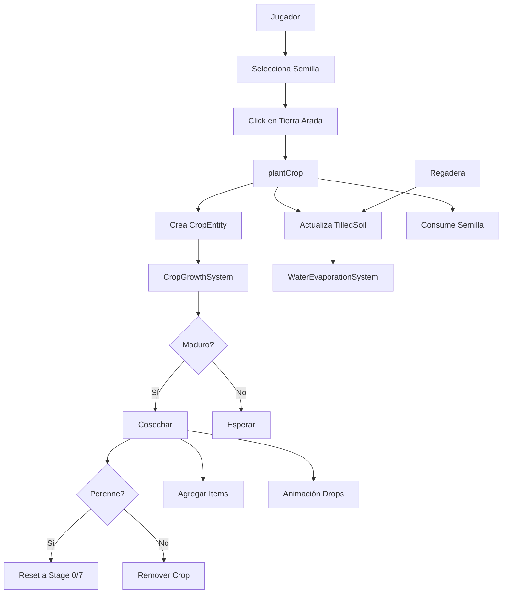

# Crop System

Sistema completo de cultivos con plantado, crecimiento, riego y cosecha.

---

## Descripción General

El sistema de cultivos permite al jugador:

1. **Plantar semillas** en tierra arada
2. **Regar** para permitir crecimiento
3. **Cosechar** cultivos maduros
4. **Gestionar perennes** (múltiples cosechas)

**Estado Actual**: ✅ Completamente funcional con 25 tipos de cultivos

---

## Arquitectura



---

## Archivos Principales

### Configuración

- **`src/constants/cropConfigs.ts`** - 25 configuraciones de cultivos
- **`src/engine/interfaces/crops.ts`** - Interfaces TypeScript

### Sistemas (Game Loop)

- **`src/engine/systems/CropGrowthSystem.ts`** - Crecimiento y muerte
- **`src/engine/systems/WaterEvaporationSystem.ts`** - Evaporación a las 6am

### Helpers

- **`src/utils/cropHelpers.ts`** - `plantCrop()`, `harvestCrop()`, `removeCrop()`

### UI

- **`src/views/game/farm/farm_view.tsx`** - Interacción con clicks
- **`src/components/Crops/Crops.tsx`** - Renderizado de sprites
- **`src/components/DroppedItems/DroppedItems.tsx`** - Animación de drops

---

## Configuración de Cultivos

### Interface: `CropConfig`

```typescript
interface CropConfig {
  // Identidad
  id: string // "crop-0-0"
  name: string // "Crop 1"

  // Spritesheet
  row: number // 0-12 (fila en spritesheet)
  cropIndex: 0 | 1 // 0 o 1 (columna en fila)
  baseIndex: number // Índice base en spritesheet
  inventoryIconIndex: number // Sprite para inventario

  // Crecimiento
  growthStages: number // 4 o 5 stages
  growthTimePerStage: number // Minutos por stage

  // Agua
  needsWater: true // Siempre true
  waterCheckInterval: 1440 // 24 horas (no usado actualmente)

  // Muerte (DESHABILITADA - ver nota abajo)
  deathTimeWithoutWater: Infinity
  deathTimeWithoutHarvest: Infinity

  // Perennes
  isPerennial: boolean // ¿Múltiples cosechas?
  maxHarvests: number // 0 = infinito
  usePermanentStage: boolean // ¿Usa sprite permanente (stage 7)?
  regrowthTimePerStage?: number // Tiempo de re-crecimiento

  // Cosecha
  harvestItem: string // ID del item que dropea
  harvestQuantity: number // Cantidad base
  minDrops?: number // Mínimo drops
  maxDrops?: number // Máximo drops
}
```

### Ejemplo: Crop One-Time

```typescript
{
  id: "crop-0-0",
  name: "Crop 1",
  row: 0,
  cropIndex: 0,
  baseIndex: 0,
  growthStages: 4,
  growthTimePerStage: 5,        // 5 min/stage = 20 min total
  isPerennial: false,
  maxHarvests: 1,
  harvestItem: "crop-1-harvest",
  harvestQuantity: 1,
  minDrops: 1,
  maxDrops: 2,
}
```

### Ejemplo: Crop Perenne

```typescript
{
  id: "crop-0-1",
  name: "Crop 2",
  row: 0,
  cropIndex: 1,
  baseIndex: 8,
  growthStages: 5,
  growthTimePerStage: 240,      // 4 horas/stage
  isPerennial: true,
  maxHarvests: 3,               // 3 cosechas máximo
  usePermanentStage: true,      // Usa sprite permanente
  regrowthTimePerStage: 120,    // 2 horas para re-crecer
  harvestItem: "crop-2-harvest",
  harvestQuantity: 1,
}
```

---

## Entity: `CropEntity`

Cada crop plantado es una entidad en `worldStore.entities`:

```typescript
interface CropEntity extends Entity {
  type: "crop"
  cropId: string // "crop-0-0"

  // Posición
  x: number // Posición visual (puede tener offset)
  y: number
  tileX: number // Tile lógico (para hitbox)
  tileY: number

  // Crecimiento
  currentStage: number // 0-5 (0 = semilla)
  plantedAt: number // Timestamp del juego
  lastWateredAt: number // Última vez que se regó
  totalGrowthMinutes: number // Minutos acumulados (solo mientras regado)

  // Cosecha
  canHarvest: boolean // ¿Listo para cosechar?
  matureAt: number | null // Cuándo llegó a maduro
  timesHarvested: number // Veces cosechado (perennes)

  // Muerte (DESHABILITADA)
  isDead: boolean
  diedAt: number | null

  // Sprite
  spriteIndex: number // Índice actual en spritesheet
  sprite: SpriteDefinition // Metadata del sprite
}
```

---

## Sistema de Crecimiento

### CropGrowthSystem

**Archivo**: `src/engine/systems/CropGrowthSystem.ts`

**Frecuencia**: Cada tick del GameLoop (~1 segundo real)

**Responsabilidades**:

1. ✅ Verificar condiciones de muerte (DESHABILITADAS)
2. ✅ Acumular tiempo de crecimiento (solo si regado)
3. ✅ Avanzar stages según tiempo acumulado
4. ✅ Marcar como `canHarvest` al llegar a stage final
5. ✅ Manejar re-crecimiento de perennes

### Flujo de Crecimiento

```typescript
// En cada tick:
for (const crop of crops) {
  if (crop.isDead) continue

  const tile = tilledSoil.get(`${crop.tileX}-${crop.tileY}`)
  if (!tile) continue

  // 1. Verificar muerte (DESHABILITADA - Infinity nunca se alcanza)
  if (timeSinceWatered >= config.deathTimeWithoutWater && !tile.isWatered) {
    crop.isDead = true // Nunca ocurre con Infinity
  }

  // 2. Acumular crecimiento SOLO si regado
  if (tile.isWatered) {
    crop.totalGrowthMinutes += 1 // 1 minuto por tick
  }

  // 3. Calcular stage actual
  const newStage = Math.min(
    config.growthStages,
    Math.floor(crop.totalGrowthMinutes / config.growthTimePerStage),
  )

  // 4. Actualizar sprite si cambió de stage
  if (newStage !== crop.currentStage) {
    crop.currentStage = newStage
    crop.spriteIndex = getCropSpriteIndex(config, newStage)
  }

  // 5. Marcar como listo para cosechar
  if (crop.currentStage >= config.growthStages && !crop.canHarvest) {
    crop.canHarvest = true
    crop.matureAt = currentTime
  }
}
```

### Perennes con Permanent Stage

Para crops con `usePermanentStage: true`:

```typescript
// Después de primera cosecha
if (config.isPerennial && config.usePermanentStage && crop.timesHarvested > 0) {
  // Ya no avanza stages, solo espera tiempo para siguiente cosecha
  const timeNeededForHarvest =
    config.regrowthTimePerStage ??
    config.growthTimePerStage * config.growthStages

  if (crop.totalGrowthMinutes >= timeNeededForHarvest && !crop.canHarvest) {
    crop.canHarvest = true
    crop.matureAt = currentTime
    crop.spriteIndex = getCropSpriteIndex(config, config.growthStages + 1) // Stage 7
  }
}
```

---

## Sistema de Agua

### Mecánica Actual

**SIMPLIFICACIÓN IMPLEMENTADA**:

- El agua **NO se consume** por los crops
- El agua se **resetea automáticamente a las 6:00 AM** cada día
- Los crops **solo verifican** si el tile está regado para crecer

### WaterEvaporationSystem

**Archivo**: `src/engine/systems/WaterEvaporationSystem.ts`

```typescript
export class WaterEvaporationSystem implements ISystem {
  private lastResetDay = 0

  update(): void {
    const { hour, day } = worldStore.getState().gameTime

    // Reset a las 6am de cada día
    if (hour === 6 && day !== this.lastResetDay) {
      this.lastResetDay = day

      // Resetear TODA el agua
      const updatedSoil = new Map(tilledSoil)
      for (const [key, tile] of updatedSoil) {
        updatedSoil.set(key, {
          ...tile,
          isWatered: false,
          wateredAt: null,
        })
      }

      worldStore.setState({ tilledSoil: updatedSoil })
    }
  }
}
```

### Ciclo Diario

```
6:00 AM → Toda el agua se evapora
    ↓
Jugador riega tiles
    ↓
Crops crecen durante el día (acumulan minutos)
    ↓
6:00 AM siguiente día → Reset
```

**Ventaja**: Simplifica la lógica, el jugador solo necesita regar una vez al día.

---

## Plantado y Cosecha

### Plantar Semilla

**Función**: `plantCrop(x, y, cropId, seedVariant)` en `cropHelpers.ts`

**Requisitos**:

1. ✅ Tile debe estar arado (`tilledSoil.has(tileKey)`)
2. ✅ Tile debe estar vacío (`tile.hasCrop === null`)
3. ✅ Jugador debe tener semilla en inventario

**Proceso**:

```typescript
export function plantCrop(x, y, cropId, seedVariant = 0) {
  const config = getCropConfig(cropId)
  const currentTime = worldStore.getState().gameTime.totalMinutes
  const tile = tilledSoil.get(`${x}-${y}`)

  // Crear CropEntity
  const cropEntity: CropEntity = {
    id: crypto.randomUUID(),
    type: "crop",
    cropId,
    x,
    y,
    tileX: x,
    tileY: y,
    currentStage: 0,
    plantedAt: currentTime,
    lastWateredAt: tile.isWatered ? currentTime : 0,
    totalGrowthMinutes: 0,
    canHarvest: false,
    matureAt: null,
    timesHarvested: 0,
    isDead: false,
    diedAt: null,
    spriteIndex: getCropSpriteIndex(config, 0, seedVariant),
    sprite: CROP_SPRITE,
  }

  // Actualizar tile
  tile.hasCrop = cropEntity.id

  // Agregar a entities
  worldStore.setState({
    entities: [...entities, cropEntity],
    tilledSoil: updatedSoil,
  })

  // Consumir semilla del inventario
  inventoryActions.removeItem(`seed-${cropId}`, 1)
}
```

### Cosechar Crop

**Función**: `harvestCrop(cropEntity)` en `cropHelpers.ts`

**Proceso One-Time**:

```typescript
if (!config.isPerennial) {
  // 1. Calcular drops
  const dropCount = calculateDropCount(config)

  // 2. Agregar a inventario
  inventoryActions.addItem(config.harvestItem, dropCount)

  // 3. Animación de drops
  dropsActions.addDrop({
    itemId: config.harvestItem,
    x: crop.x,
    y: crop.y,
    count: dropCount,
  })

  // 4. Remover crop
  removeCrop(crop.id)

  return { itemId: config.harvestItem, quantity: dropCount }
}
```

**Proceso Perenne**:

```typescript
if (config.isPerennial) {
  // 1. Agregar drops
  inventoryActions.addItem(config.harvestItem, dropCount)
  dropsActions.addDrop(...)

  // 2. Incrementar contador
  crop.timesHarvested++

  // 3. Reset según configuración
  if (config.usePermanentStage) {
    // Mantener en stage 7 (permanente)
    crop.spriteIndex = getCropSpriteIndex(config, config.growthStages + 1)
  } else {
    // Resetear a semilla (stage 0)
    crop.currentStage = 0
    crop.spriteIndex = getCropSpriteIndex(config, 0)
  }

  // 4. Reset estado
  crop.canHarvest = false
  crop.matureAt = null
  crop.totalGrowthMinutes = 0

  // 5. Verificar máximo de cosechas
  if (config.maxHarvests > 0 && crop.timesHarvested >= config.maxHarvests) {
    removeCrop(crop.id)
  }

  return { itemId: config.harvestItem, quantity: dropCount }
}
```

---

## Sprites y Renderizado

### Spritesheet Layout

**Archivo**: `public/crops.png` (320×208px)

**Estructura**: 13 filas × 16 columnas

Cada crop ocupa **1 fila (16 sprites)**:

| Índice | Uso                              |
| ------ | -------------------------------- |
| 0-1    | Semilla (2 variantes)            |
| 2-6    | Stages de crecimiento (5 stages) |
| 7      | Stage permanente (perennes)      |
| 8-11   | Reservado                        |
| 12-15  | Sprites marchitos (muerte)       |

### Cálculo de Sprite Index

```typescript
export function getCropSpriteIndex(
  config: CropConfig,
  currentStage: number,
  seedVariant?: 0 | 1,
): number {
  const { baseIndex, growthStages, usePermanentStage } = config

  // Stage 0: Semilla
  if (currentStage === 0) {
    const variant = seedVariant ?? Math.floor(Math.random() * 2)
    return baseIndex + variant
  }

  // Stage 1-5: Crecimiento
  if (currentStage >= 1 && currentStage <= growthStages) {
    return baseIndex + 1 + currentStage
  }

  // Stage 6+: Permanente o último
  if (usePermanentStage) {
    return baseIndex + 7
  } else {
    return baseIndex + 1 + growthStages
  }
}
```

### Renderizado

**Componente**: `src/components/Crops/Crops.tsx`

```typescript
<div
  style={{
    position: "absolute",
    left: crop.x * TILE_SIZE,
    top: crop.y * TILE_SIZE,
    ...renderEntity(crop),
  }}
/>
```

---

## Interacción con Herramientas

### Regadera (Watering Can)

- **Acción**: Riega el **tile**, no el crop
- **Visual**: Borde azul en hover sobre crops
- **Efecto**: `tile.isWatered = true`

Ver: [`../tools/watering-can.md`](../tools/watering-can.md)

### Guadaña (Scythe)

- **Acción**: Cosecha crops maduros
- **Visual**:
  - Verde = listo para cosechar
  - Rojo = no listo
- **Efecto**: Llama `harvestCrop()`

### Pico (Pickaxe)

- **Acción**: Puede remover crops muertos (futuro)
- **Visual**: Borde blanco en crops muertos

---

## Muerte de Cultivos

### Estado Actual: DESHABILITADA

**Razón**: Mecánica temporal durante desarrollo

**Implementación**:

```typescript
// En cropConfigs.ts
deathTimeWithoutWater: Infinity
deathTimeWithoutHarvest: Infinity
```

**Efecto**: Las comparaciones `>=` nunca se cumplen, los crops nunca mueren.

**Futuro**: Se implementará con nueva mecánica mejorada.

Ver: [`../../ai/knowing_issues.md`](../../ai/knowing_issues.md)

---

## Animación de Drops

### DropsStore

**Archivo**: `src/engine/dropsStore.ts`

**Propósito**: Store aislado para animaciones de drops (no afecta performance del juego)

```typescript
interface Drop {
  id: string
  itemId: string
  x: number
  y: number
  createdAt: number
  offsetX: number // Dispersión radial
  offsetY: number
}
```

### Animación

**Duración**: 350ms  
**Efecto**:

- Spawn 16px arriba del centro del crop
- Explosión radial (prioridad vertical)
- Fade out
- Z-index alto (siempre encima)

**Componente**: `src/components/DroppedItems/DroppedItems.tsx`

---

## Debugging

### Crop No Crece

**Checklist**:

1. ✅ ¿Tile está regado? (`tile.isWatered === true`)
2. ✅ ¿Es antes de las 6am? (agua se resetea a las 6am)
3. ✅ ¿`totalGrowthMinutes` está aumentando?

### Sprite Incorrecto

**Checklist**:

1. ✅ Verificar `baseIndex` en config
2. ✅ Verificar `currentStage`
3. ✅ Verificar cálculo en `getCropSpriteIndex()`

### Perenne No Resetea

**Checklist**:

1. ✅ ¿`usePermanentStage` está correcto?
2. ✅ ¿`timesHarvested` se incrementa?
3. ✅ ¿`totalGrowthMinutes` se resetea a 0?

---

## Archivos Relacionados

### Core

- `src/constants/cropConfigs.ts` - Configuraciones
- `src/engine/interfaces/crops.ts` - Interfaces
- `src/engine/systems/CropGrowthSystem.ts` - Sistema de crecimiento
- `src/engine/systems/WaterEvaporationSystem.ts` - Evaporación

### Helpers

- `src/utils/cropHelpers.ts` - Plantar, cosechar, remover

### UI

- `src/components/Crops/Crops.tsx` - Renderizado
- `src/components/DroppedItems/DroppedItems.tsx` - Animación drops
- `src/components/GameEntities/GameEntities.tsx` - Hover feedback

### Stores

- `src/engine/store.ts` - Estado de entidades y tierra
- `src/engine/dropsStore.ts` - Animaciones de drops
- `src/engine/inventoryStore.ts` - Items cosechados
